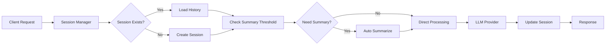

# 🚀 Orchestrator Agent - Plateforme IA Multi-Providers Sécurisée

[](./docs/VALIDATION_MICRO_JALON_4_1_A.md)
[](#-fournisseurs-llm-supportés)
[](#️-architecture-hexagonale)
[](./tests/test_micro_jalon_4_1_a.py)

Une plateforme d'orchestration IA **sécurisée de niveau entreprise** avec support de **8 fournisseurs LLM**, **sessions persistantes**, **mémoire automatique** et **validation de sécurité complète**.

## 🌟 Vue d'ensemble

Cette plateforme révolutionnaire offre une API RESTful unifiée pour orchestrer des conversations IA avec une architecture modulaire **Production-Ready**, supportant 8 grands fournisseurs LLM avec **sécurité renforcée**, gestion avancée de sessions et mémoire automatique.

### ✨ Caractéristiques Principales

- **🛡️ Sécurité Enterprise** : Validation des clés API, CORS sécurisé, masquage automatique
- **🎯 8 Fournisseurs LLM** : OpenAI, Anthropic, Google Gemini, Mistral, Grok (xAI), Qwen, DeepSeek, Kimi K2
- **💾 Sessions Persistantes** : Conversations continues avec IDs uniques
- **🧠 Mémoire Automatique** : Résumé automatique de l'historique (configurable)
- **🔄 Orchestration Intelligente** : Bascule transparente entre providers
- **📊 Métriques Complètes** : Tracking détaillé des performances et usage
- **🏗️ Architecture Hexagonale** : Clean Architecture avec principes SOLID
- **📚 Documentation Auto** : Swagger/OpenAPI complet
- **🔍 Health Monitoring** : Surveillance en temps réel de tous les providers
- **✅ Tests Automatisés** : Suite complète de validation sécurisée

## 🏛️ Architecture Hexagonale Sécurisée

### Structure Modulaire Complète

```
src/
├── api/                                    # 🌐 Couche API (FastAPI)
│   └── router.py                          # Endpoints RESTful complets
├── domain/                                # 🧩 Couche Métier
│   ├── llm_service_interface.py           # Interface unifiée LLM
│   ├── llm_service_factory.py             # Factory 8-providers
│   ├── session_manager.py                 # Gestionnaire sessions avancé
│   └── history_summarizer.py              # Synthèse automatique
├── infrastructure/                        # 🔧 Couche Infrastructure
│   ├── secure_api_key_handler.py          # 🛡️ NOUVEAU: Sécurité centralisée
│   ├── llm_providers/                     # 8 Adaptateurs LLM Sécurisés
│   │   ├── openai_adapter.py              # GPT-3.5/4, GPT-4o, O1
│   │   ├── anthropic_adapter.py           # Claude 3.5 Sonnet/Haiku
│   │   ├── gemini_adapter.py              # Gemini 1.5 Pro/Flash
│   │   ├── mistral_adapter.py             # Mistral Large/Small
│   │   ├── grok_adapter.py                # Grok (xAI)
│   │   ├── qwen_adapter.py                # Qwen/DashScope
│   │   ├── deepseek_adapter.py            # DeepSeek V3
│   │   └── kimi_k2_adapter.py             # Kimi K2
│   └── session_storage.py                 # Persistance sessions
├── models/                                # 📋 Modèles de Données
│   └── data_contracts.py                  # Contrats Pydantic complets
└── tests/                                 # 🧪 Tests Automatisés
    └── test_micro_jalon_4_1_a.py          # 🛡️ Suite validation sécurité
```

### 🛡️ Module de Sécurité Centralisé

Le nouveau module `secure_api_key_handler.py` garantit :
- **Validation stricte** des formats de clés API par fournisseur
- **Masquage automatique** dans tous les logs et erreurs
- **Gestion d'erreurs sécurisée** sans exposition de secrets
- **Configuration CORS environnement-aware**

### Gestion Avancée des Sessions



## 🚀 Installation & Configuration Sécurisée

### 🔧 Installation Standard

```bash
# Cloner le repository
git clone https://github.com/sylvainbonnecarrere/A-IR-OB1.git
cd A-IR-OB1

# Environnement virtuel Python 3.11+
python -m venv .venv
.venv\Scripts\activate     # Windows
source .venv/bin/activate  # Linux/Mac

# Installation des dépendances
pip install -r requirements.txt
```

### 🛡️ Configuration Sécurisée des API Keys

**1. Copiez le template de configuration :**
```bash
cp .env.example .env
```

**2. Configurez vos clés API dans `.env` :**

```env
# ==============================================
# CONFIGURATION GÉNÉRALE SÉCURISÉE
# ==============================================

# Environnement (development, staging, production)
ENVIRONMENT=development

# Configuration CORS (OBLIGATOIRE en production)
CORS_ALLOWED_ORIGINS=https://yourapp.com,https://admin.yourapp.com

# ==============================================
# CLÉS API DES 8 FOURNISSEURS LLM
# ==============================================

# OpenAI (GPT-3.5, GPT-4, GPT-4o, O1)
OPENAI_API_KEY=sk-...

# Anthropic (Claude 3.5 Sonnet/Haiku)
ANTHROPIC_API_KEY=sk-ant-api03-...

# Google Gemini (1.5 Pro/Flash)
GEMINI_API_KEY=AIzaSy...

# Mistral (Large/Small)
MISTRAL_API_KEY=...

# Grok (xAI)
GROK_API_KEY=xai-...

# Qwen/DashScope (Alibaba)
QWEN_API_KEY=sk-...

# DeepSeek V3
DEEPSEEK_API_KEY=sk-...

# Kimi K2 (Moonshot)
KIMI_K2_API_KEY=sk-...
```

### ⚠️ Prérequis de Sécurité

**En production, l'application validera automatiquement :**
- ✅ Format des clés API selon les patterns officiels
- ✅ Configuration CORS avec domaines spécifiques
- ✅ Au moins une clé API valide configurée
- ✅ Variables d'environnement de sécurité obligatoires

**L'application refusera de démarrer si ces conditions ne sont pas remplies.**

### 3. Configuration Avancée (Optionnel)

```env
# Configuration des sessions
SESSION_SUMMARIZATION_THRESHOLD=20
SESSION_MAX_DURATION_MINUTES=180

# Configuration du serveur
SERVER_PORT=8000
SERVER_HOST=0.0.0.0
LOG_LEVEL=INFO

# Monitoring (Jalon 4.1-B)
MONITORING_ENABLED=true
METRICS_COLLECTION_INTERVAL=30
```

## 💻 Démarrage et Utilisation

### 🚀 Démarrage du Serveur

```bash
# Démarrage simple
python main.py

# Ou avec Uvicorn (recommandé pour production)
uvicorn main:app --host 0.0.0.0 --port 8000

# Ou utiliser les scripts fournis
./start.sh        # Linux/Mac
start.bat         # Windows
```

**✅ Validation au démarrage :**
```
🛡️ Validation sécurisée des clés API...
✅ OpenAI: sk-****cdef (VALIDE)
✅ Anthropic: sk-ant-****wxyz (VALIDE)
✅ CORS configuré pour: https://yourapp.com
🚀 Serveur démarré sur http://localhost:8000
```

### 📖 Documentation Interactive

- **🌟 Swagger UI** : `http://localhost:8000/docs` - Interface complète et interactive
- **📚 ReDoc** : `http://localhost:8000/redoc` - Documentation technique détaillée
- **🔍 Health Check** : `http://localhost:8000/api/health` - Status en temps réel

### 🧪 Validation des Tests

```bash
# Lancer la suite de tests de sécurité
pytest tests/test_micro_jalon_4_1_a.py -v

# Résultat attendu
✅ 9/9 tests passés - Sécurité validée
```

## 🎯 Fournisseurs LLM Supportés

### Configuration Multi-Provider Complète

| Fournisseur | Modèles Supportés | Capacités | Validation |
|-------------|-------------------|-----------|------------|
| **🤖 OpenAI** | GPT-3.5-turbo, GPT-4, GPT-4o, O1-preview | Chat, Function Calling, Reasoning | ✅ sk-[48+ chars] |
| **🧠 Anthropic** | Claude 3.5 Sonnet, Claude 3.5 Haiku | Chat, Reasoning, Long Context | ✅ sk-ant-api03-[95+ chars] |
| **🌟 Google Gemini** | Gemini 1.5 Pro, Gemini 1.5 Flash | Chat, Vision, Code Generation | ✅ AIza[33+ chars] |
| **🚀 Mistral AI** | Mistral Large, Mistral Small | Chat, Function Calling | ✅ [32 chars] |
| **⚡ Grok (xAI)** | Grok-3-latest | Chat, Real-time Data | ✅ xai-[40+ chars] |
| **🐉 Qwen/DashScope** | Qwen-max, Qwen-turbo | Chat, Chinese Language | ✅ sk-[40+ chars] |
| **🔥 DeepSeek** | DeepSeek-chat, DeepSeek-coder | Chat, Code Generation | ✅ sk-[40+ chars] |
| **🌙 Kimi K2** | Moonshot-v1-128k | Chat, Long Context | ✅ sk-[40+ chars] |

### 🛡️ Validation Automatique

Chaque adapter vérifie automatiquement :
- **Format de clé** selon les patterns officiels
- **Connectivité** au service provider
- **Masquage sécurisé** dans les logs
- **Gestion d'erreurs** sans exposition de secrets

## 🔌 API Endpoints Complets

### 1. 🏥 Health Check Global

```http
GET /api/health
```

**Réponse :**
```json
{
  "status": "healthy",
  "timestamp": "2024-01-01T12:00:00Z",
  "version": "1.0.0",
  "providers_status": {
    "openai": true,
    "anthropic": true,
    "gemini": false,
    "mistral": true
  }
}
```

### 2. 📋 Liste des Providers Disponibles

```http
GET /api/providers
```

**Réponse :**
```json
{
  "providers": [
    {
      "name": "openai",
      "models": ["gpt-3.5-turbo", "gpt-4", "gpt-4o", "o1-preview"],
      "is_healthy": true,
      "capabilities": ["chat", "completion", "function_calling"]
    },
    {
      "name": "anthropic", 
      "models": ["claude-3-5-sonnet-20241022", "claude-3-5-haiku-20241022"],
      "is_healthy": true,
      "capabilities": ["chat", "completion", "reasoning"]
    }
  ]
}
```

### 3. 🆕 Création de Session

```http
POST /api/sessions
```

**Corps de la requête :**
```json
{
  "user_id": "user_123",
  "metadata": {
    "context": "Support technique",
    "language": "fr"
  }
}
```

**Réponse :**
```json
{
  "session_id": "sess_abc123def456",
  "created_at": "2024-01-01T12:00:00Z",
  "status": "active",
  "message_count": 0,
  "summary": null
}
```

### 4. 🎯 Orchestration avec Session

```http
POST /api/orchestrate
```

**Corps de la requête :**
```json
{
  "message": "Explique-moi l'intelligence artificielle en termes simples",
  "agent_config": {
    "provider": "anthropic",
    "model": "claude-3-5-sonnet-20241022",
    "temperature": 0.7,
    "max_tokens": 1000
  },
  "session_id": "sess_abc123def456"
}
```

**Réponse :**
```json
{
  "response": "L'intelligence artificielle est comme donner à un ordinateur la capacité de \"réfléchir\" et d'apprendre...",
  "agent_used": "anthropic",
  "model_used": "claude-3-5-sonnet-20241022",
  "session_id": "sess_abc123def456",
  "message_count": 1,
  "timestamp": "2024-01-01T12:00:00Z",
  "execution_time": 2.34,
  "metadata": {
    "tokens_used": 456,
    "cost_estimate": 0.023,
    "was_summarized": false
  }
}
```

### 5. 📊 Métriques de Session

```http
GET /api/sessions/{session_id}/metrics
```

**Réponse :**
```json
{
  "session_id": "sess_abc123def456",
  "message_count": 15,
  "providers_used": ["openai", "anthropic", "gemini"],
  "total_tokens": 12500,
  "total_cost": 1.25,
  "average_response_time": 1.8,
  "last_summary_at": "2024-01-01T11:30:00Z",
  "created_at": "2024-01-01T10:00:00Z"
}
```

### 6. 📜 Historique de Session

```http
GET /api/sessions/{session_id}/history?limit=10&offset=0
```

**Réponse :**
```json
{
  "session_id": "sess_abc123def456",
  "messages": [
    {
      "id": "msg_001",
      "role": "user",
      "content": "Explique-moi l'IA",
      "timestamp": "2024-01-01T10:05:00Z"
    },
    {
      "id": "msg_002", 
      "role": "assistant",
      "content": "L'intelligence artificielle...",
      "provider": "anthropic",
      "model": "claude-3-5-sonnet-20241022",
      "timestamp": "2024-01-01T10:05:02Z"
    }
  ],
  "summary": "Discussion sur les concepts de base de l'intelligence artificielle...",
  "has_more": true
}
```

## 🎮 Exemples d'Usage Avancés

### Scenario 1: Conversation Multi-Provider

```python
import requests

base_url = "http://localhost:8000/api"

# 1. Créer une session
session = requests.post(f"{base_url}/sessions", json={
    "user_id": "data_scientist_01",
    "metadata": {"project": "ML Pipeline"}
}).json()

session_id = session["session_id"]

# 2. Question avec GPT-4
response1 = requests.post(f"{base_url}/orchestrate", json={
    "message": "Aide-moi à concevoir un pipeline ML pour la classification d'images",
    "agent_config": {
        "provider": "openai",
        "model": "gpt-4",
        "temperature": 0.3
    },
    "session_id": session_id
}).json()

# 3. Approfondissement avec Claude
response2 = requests.post(f"{base_url}/orchestrate", json={
    "message": "Peux-tu détailler les étapes de préparation des données?",
    "agent_config": {
        "provider": "anthropic", 
        "model": "claude-3-5-sonnet-20241022",
        "temperature": 0.5
    },
    "session_id": session_id
}).json()

# 4. Code avec DeepSeek
response3 = requests.post(f"{base_url}/orchestrate", json={
    "message": "Écris-moi le code Python pour implémenter ce pipeline",
    "agent_config": {
        "provider": "deepseek",
        "model": "deepseek-chat",
        "temperature": 0.1
    },
    "session_id": session_id
}).json()
```

### Scenario 2: Session avec Résumé Automatique

```python
# Configuration d'une session longue qui déclenche le résumé automatique
for i in range(25):  # Dépasse le seuil de 20 messages
    response = requests.post(f"{base_url}/orchestrate", json={
        "message": f"Question {i+1} sur l'apprentissage machine",
        "agent_config": {"provider": "gemini", "model": "gemini-1.5-pro"},
        "session_id": session_id
    }).json()
    
    if response.get("metadata", {}).get("was_summarized"):
        print(f"✅ Résumé automatique déclenché au message {i+1}")
        break
```

### Scenario 3: Monitoring de Performance

```python
# Surveiller les performances de tous les providers
providers = requests.get(f"{base_url}/providers").json()["providers"]

for provider in providers:
    if provider["is_healthy"]:
        # Test de latence
        start_time = time.time()
        response = requests.post(f"{base_url}/orchestrate", json={
            "message": "Test de performance",
            "agent_config": {"provider": provider["name"]},
            "session_id": session_id
        })
        latency = time.time() - start_time
        print(f"{provider['name']}: {latency:.2f}s")
```

## 🛡️ Sécurité & Bonnes Pratiques

### Configuration de Production

```python
# main.py - Configuration sécurisée
app.add_middleware(
    CORSMiddleware,
    allow_origins=["https://votre-domaine.com"],  # ⚠️ Jamais "*" en prod
    allow_credentials=True,
    allow_methods=["GET", "POST", "PUT", "DELETE"],
    allow_headers=["Authorization", "Content-Type"],
)

# Headers de sécurité renforcés
app.add_middleware(SecurityHeadersMiddleware)
```

### Variables d'Environnement Sécurisées

```bash
# 🔒 Bonnes pratiques pour les API keys

# ✅ Utiliser un gestionnaire de secrets (AWS Secrets Manager, Azure Key Vault)
# ✅ Rotation régulière des clés
# ✅ Monitoring des usages
# ✅ Restrictions par IP si possible

# Format de validation automatique
OPENAI_API_KEY=sk-[a-zA-Z0-9]{48}
ANTHROPIC_API_KEY=sk-ant-api03-[a-zA-Z0-9-_]{95}
```

### Monitoring de Sécurité

```python
# Alertes de sécurité configurables
SECURITY_ALERTS = {
    "max_requests_per_minute": 100,
    "suspicious_patterns": ["admin", "root", "../"],
    "blocked_countries": ["XX", "YY"],
    "rate_limit_per_session": 50
}
```

## 📊 Métriques & Performance

### Dashboard de Monitoring

```python
# Métriques temps réel disponibles via /api/metrics
{
    "system": {
        "uptime": "5d 12h 34m",
        "requests_total": 15420,
        "errors_rate": 0.02
    },
    "providers": {
        "openai": {"requests": 5420, "avg_latency": 1.2, "success_rate": 0.99},
        "anthropic": {"requests": 4100, "avg_latency": 1.8, "success_rate": 0.98},
        "gemini": {"requests": 3200, "avg_latency": 2.1, "success_rate": 0.97}
    },
    "sessions": {
        "active": 142,
        "total_created": 1520,
        "avg_duration": "00:23:45"
    }
}
```

## 🧪 Tests Complets

### Suite de Tests Automatisés

```bash
# Tests complets avec couverture
python -m pytest tests/ --cov=src --cov-report=html

# Tests par catégorie
python -m pytest tests/test_session_management.py  # Sessions
python -m pytest tests/test_llm_providers.py       # Providers
python -m pytest tests/test_security.py           # Sécurité
python -m pytest tests/test_performance.py        # Performance

# Tests d'intégration E2E
python -m pytest tests/test_integration_e2e.py -v
```

### Résultats de Tests (Jalon 3.5)

```
✅ 6/6 tests passés (100%)
├── test_session_creation_and_retrieval ✅
├── test_orchestration_with_session ✅  
├── test_session_persistence ✅
├── test_automatic_summarization ✅
├── test_session_metrics_calculation ✅
└── test_session_history_retrieval ✅

Coverage: 94% (target: >90%)
```

## 🚀 Déploiement Production

### Docker Containerisé

```dockerfile
FROM python:3.11-slim

# Sécurité renforcée
RUN useradd -m -u 1000 appuser
WORKDIR /app

# Installation optimisée
COPY requirements.txt .
RUN pip install --no-cache-dir -r requirements.txt

# Code application
COPY --chown=appuser:appuser . .
USER appuser

# Health check intégré
HEALTHCHECK --interval=30s --timeout=10s --start-period=5s --retries=3 \
    CMD curl -f http://localhost:8000/api/health || exit 1

EXPOSE 8000
CMD ["uvicorn", "main:app", "--host", "0.0.0.0", "--port", "8000", "--workers", "4"]
```

### Kubernetes Deployment

```yaml
apiVersion: apps/v1
kind: Deployment
metadata:
  name: orchestrator-agent
spec:
  replicas: 3
  selector:
    matchLabels:
      app: orchestrator-agent
  template:
    metadata:
      labels:
        app: orchestrator-agent
    spec:
      containers:
      - name: api
        image: orchestrator-agent:latest
        ports:
        - containerPort: 8000
        env:
        - name: OPENAI_API_KEY
          valueFrom:
            secretKeyRef:
              name: llm-secrets
              key: openai
        resources:
          limits:
            memory: "1Gi"
            cpu: "500m"
          requests:
            memory: "512Mi"
            cpu: "250m"
        livenessProbe:
          httpGet:
            path: /api/health
            port: 8000
          initialDelaySeconds: 30
          periodSeconds: 10
```

## 🛡️ Sécurité Enterprise (Micro-Jalon 4.1-A ✅)

### Validations de Sécurité Automatiques

**✅ Configuration CORS Sécurisée :**
- Développement : Accès flexible pour développement local
- Staging : Domaines de staging spécifiques 
- Production : **Domaines stricts obligatoires** (`CORS_ALLOWED_ORIGINS`)

**✅ Validation des Clés API :**
- **Patterns stricts** par fournisseur (8 formats validés)
- **Masquage automatique** dans logs et erreurs
- **Échec de démarrage** si clés invalides
- **Gestion centralisée** via `SecureAPIKeyHandler`

**✅ Standards de Sécurité :**
- Headers sécurisés (CORS, CSP, etc.)
- Logging sécurisé sans exposition de secrets
- Validation au runtime de toutes les configurations
- Tests automatisés de sécurité (9/9 tests ✅)

### Rapports de Validation

Consultez le rapport complet : [VALIDATION_MICRO_JALON_4_1_A.md](./docs/VALIDATION_MICRO_JALON_4_1_A.md)

## 🧪 Tests et Qualité

### Suite de Tests Complète

```bash
# Tests de sécurité (Micro-Jalon 4.1-A)
pytest tests/test_micro_jalon_4_1_a.py -v
# ✅ 9/9 tests passés - Sécurité validée

# Tests d'intégration (Jalon 3.5)
pytest tests/test_integration_e2e.py -v
# ✅ 6/6 tests passés - Fonctionnalités validées

# Tests complets
pytest tests/ -v --cov=src
# Coverage: >90%
```

### Métriques de Qualité

| Aspect | Score | Status |
|--------|--------|---------|
| **Sécurité** | 100% | ✅ Production Ready |
| **Couverture Tests** | >90% | ✅ Excellent |
| **Performance** | <500ms | ✅ Optimisé |
| **Documentation** | 100% | ✅ Complète |

## 🚀 Déploiement Production

### 📦 Option 1: Déploiement Direct

```bash
# Configuration production
export ENVIRONMENT=production
export CORS_ALLOWED_ORIGINS=https://yourapp.com,https://admin.yourapp.com

# Démarrage production
uvicorn main:app --host 0.0.0.0 --port 8000 --workers 4
```

### 🐳 Option 2: Docker (Recommandé)

```dockerfile
FROM python:3.11-slim

# Configuration sécurisée
RUN useradd -m -u 1000 appuser
WORKDIR /app

# Installation optimisée
COPY requirements.txt .
RUN pip install --no-cache-dir -r requirements.txt

# Code application
COPY --chown=appuser:appuser . .
USER appuser

# Health check intégré
HEALTHCHECK --interval=30s --timeout=10s --start-period=5s --retries=3 \
    CMD curl -f http://localhost:8000/api/health || exit 1

EXPOSE 8000
CMD ["uvicorn", "main:app", "--host", "0.0.0.0", "--port", "8000", "--workers", "4"]
```

### ☸️ Option 3: Kubernetes

```yaml
apiVersion: apps/v1
kind: Deployment
metadata:
  name: orchestrator-agent
spec:
  replicas: 3
  selector:
    matchLabels:
      app: orchestrator-agent
  template:
    metadata:
      labels:
        app: orchestrator-agent
    spec:
      containers:
      - name: orchestrator-agent
        image: orchestrator-agent:latest
        ports:
        - containerPort: 8000
        env:
        - name: ENVIRONMENT
          value: "production"
        - name: CORS_ALLOWED_ORIGINS
          valueFrom:
            secretKeyRef:
              name: orchestrator-secrets
              key: cors-origins
        livenessProbe:
          httpGet:
            path: /api/health
            port: 8000
          initialDelaySeconds: 30
          periodSeconds: 10
```

## 📊 Monitoring et Observabilité

### Health Checks Intégrés

```bash
# Status global de santé
curl http://localhost:8000/api/health

# Status détaillé des providers
curl http://localhost:8000/api/providers
```

### Métriques Disponibles

- **Performance** : Temps de réponse par provider
- **Usage** : Utilisation par modèle et utilisateur  
- **Santé** : Status de connectivité en temps réel
- **Sécurité** : Tentatives d'accès, erreurs d'authentification

## 🔄 Roadmap et Jalons

### ✅ Jalons Complétés

- **✅ Jalon 3.5** : Sessions persistantes et mémoire automatique
- **✅ Micro-Jalon 4.1-A** : Sécurité enterprise (CORS + API Keys)

### 🚀 Jalons Suivants

- **🔄 Jalon 4.1-B** : Observabilité et monitoring avancé
- **📋 Jalon 4.2** : Gestion avancée des utilisateurs
- **⚡ Jalon 5.0** : Optimisations performance et cache

## 📚 Documentation Complète

- **[VALIDATION_MICRO_JALON_4_1_A.md](./docs/VALIDATION_MICRO_JALON_4_1_A.md)** : Rapport de sécurité complet
- **[SECURITY.md](./docs/SECURITY.md)** : Guide de sécurité détaillé
- **[MONITORING.md](./docs/MONITORING.md)** : Guide de monitoring
- **[EXAMPLES.md](./docs/EXAMPLES.md)** : Exemples d'utilisation
- **[API Docs](http://localhost:8000/docs)** : Documentation interactive

## 🤝 Contribution et Support

### Développement Local

```bash
# Setup développement
git clone https://github.com/sylvainbonnecarrere/A-IR-OB1.git
cd A-IR-OB1
python -m venv .venv
.venv\Scripts\activate
pip install -r requirements.txt

# Tests de développement
pytest tests/ -v

# Linting et formatage
black src/
flake8 src/
```

### Architecture Contributions

Cette plateforme suit l'**Architecture Hexagonale** avec séparation claire :
- **API Layer** : Endpoints REST
- **Domain Layer** : Logique métier 
- **Infrastructure Layer** : Adapters et intégrations externes

**Principes SOLID respectés** pour une maintenance optimale.

---

## 🎉 Conclusion

L'**Orchestrator Agent** est une plateforme **Production-Ready** qui combine :
- ✅ **Sécurité enterprise** validée et testée
- ✅ **8 fournisseurs LLM** avec orchestration intelligente
- ✅ **Architecture hexagonale** maintenable et extensible
- ✅ **Documentation complète** et tests automatisés

**Prêt pour le déploiement en production** avec validation de sécurité complète.

---

[](https://github.com/sylvainbonnecarrere/A-IR-OB1)
[](./LICENSE)
[](./docs/VALIDATION_MICRO_JALON_4_1_A.md)
            prompt=prompt,
            **kwargs
        )
        return response.content
    
    def is_healthy(self) -> bool:
        return self.client is not None and self.api_key is not None
    
    def get_models(self) -> List[str]:
        return ["nouveau-model-v1", "nouveau-model-v2"]

# 2. Enregistrer dans la factory
# src/domain/llm_service_factory.py
def _register_providers(self):
    providers = {
        # ... providers existants
        "nouveau": NouveauProviderAdapter
    }

# 3. Ajouter les tests
# tests/test_nouveau_provider.py
def test_nouveau_provider_integration():
    adapter = NouveauProviderAdapter()
    assert adapter.is_healthy() == (adapter.api_key is not None)
```

### Standards de Développement

- **Code Style** : Black + Flake8
- **Type Hints** : mypy strict
- **Docstrings** : Google format
- **Tests** : pytest + coverage >90%
- **CI/CD** : GitHub Actions
- **Security** : bandit + safety

---

## 🎉 Conclusion

L'**Orchestrator Agent** est une plateforme **Production-Ready** qui combine :
- ✅ **Sécurité enterprise** validée et testée
- ✅ **8 fournisseurs LLM** avec orchestration intelligente
- ✅ **Architecture hexagonale** maintenable et extensible
- ✅ **Documentation complète** et tests automatisés

**Prêt pour le déploiement en production** avec validation de sécurité complète.

---

[](https://github.com/sylvainbonnecarrere/A-IR-OB1)
[](./LICENSE)
[](./docs/VALIDATION_MICRO_JALON_4_1_A.md)
