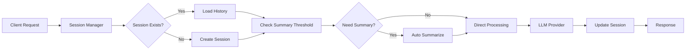

# 🚀 Orchestrator Agent - Plateforme IA Multi-Providers Avancée

Une plateforme d'orchestration IA sophistiquée avec support de **8 fournisseurs LLM**, gestion de **sessions persistantes**, **mémoire automatique** et **architecture hexagonale** complète.

## 🌟 Vue d'ensemble

Cette plateforme révolutionnaire offre une API RESTful unifiée pour orchestrer des conversations IA avec une architecture modulaire de niveau entreprise, supportant 8 grands fournisseurs LLM avec une gestion avancée de sessions et une mémoire automatique.

### ✨ Caractéristiques Principales

- **🎯 8 Fournisseurs LLM** : OpenAI, Anthropic, Google Gemini, Mistral, Grok (xAI), Qwen, DeepSeek, Kimi K2
- **💾 Sessions Persistantes** : Conversations continues avec IDs uniques
- **🧠 Mémoire Automatique** : Résumé automatique de l'historique (configurable)
- **🔄 Orchestration Intelligente** : Bascule transparente entre providers
- **📊 Métriques Complètes** : Tracking détaillé des performances et usage
- **🛡️ Sécurité Renforcée** : Validation robuste, headers sécurisés
- **🏗️ Architecture Hexagonale** : Clean Architecture avec principes SOLID
- **📚 Documentation Auto** : Swagger/OpenAPI complet
- **🔍 Health Monitoring** : Surveillance en temps réel de tous les providers

## 🏛️ Architecture Avancée

### Structure Modulaire Complète

```
src/
├── api/                           # 🌐 Couche API (FastAPI)
│   └── router.py                 # Endpoints RESTful complets
├── domain/                       # 🧩 Couche Métier
│   ├── llm_service_interface.py  # Interface unifiée LLM
│   ├── llm_service_factory.py    # Factory 8-providers
│   └── session_manager.py        # Gestionnaire sessions avancé
├── infrastructure/               # 🔧 Couche Infrastructure
│   ├── llm_providers/           # 8 Adaptateurs LLM
│   │   ├── openai_adapter.py    # GPT-3.5/4, GPT-4o, O1
│   │   ├── anthropic_adapter.py # Claude 3.5 Sonnet/Haiku
│   │   ├── gemini_adapter.py    # Gemini 1.5 Pro/Flash
│   │   ├── mistral_adapter.py   # Mistral Large/Small
│   │   ├── grok_adapter.py      # Grok (xAI)
│   │   ├── qwen_adapter.py      # Qwen/DashScope
│   │   ├── deepseek_adapter.py  # DeepSeek V3
│   │   └── kimi_k2_adapter.py   # Kimi K2
│   └── session_storage.py       # Persistance sessions
└── models/                      # 📋 Modèles de Données
    └── data_contracts.py        # Contrats Pydantic complets
```

### Gestion Avancée des Sessions



## 🚀 Installation & Configuration

### 1. Installation Standard

```bash
# Cloner le repository
git clone <repository-url>
cd orchestrator_agent_py

# Environnement virtuel Python 3.11+
python -m venv venv
source venv/bin/activate  # Linux/Mac
venv\Scripts\activate     # Windows

# Installation des dépendances
pip install -r requirements.txt
```

### 2. Configuration Sécurisée des API Keys

Créez un fichier `.env` dans le répertoire racine :

```env
# 🔑 Configuration des 8 Fournisseurs LLM

# OpenAI (GPT-3.5, GPT-4, GPT-4o, O1)
OPENAI_API_KEY=sk-...

# Anthropic (Claude 3.5 Sonnet/Haiku)
ANTHROPIC_API_KEY=sk-ant-api03-...

# Google Gemini (1.5 Pro/Flash)
GEMINI_API_KEY=AIzaSy...

# Mistral (Large/Small)
MISTRAL_API_KEY=...

# Grok (xAI)
GROK_API_KEY=xai-...

# Qwen/DashScope (Alibaba)
QWEN_API_KEY=sk-...

# DeepSeek V3
DEEPSEEK_API_KEY=sk-...

# Kimi K2 (Moonshot)
KIMI_K2_API_KEY=sk-...
```

### 3. Configuration Avancée

```python
# Configuration dans main.py
SESSION_SUMMARIZATION_THRESHOLD = 20  # Messages avant résumé auto
MAX_SESSION_HISTORY = 50             # Limite historique
CORS_ORIGINS = ["http://localhost:3000"]  # Domaines autorisés
```

## 💻 Utilisation Complète

### Démarrage du Serveur

```bash
python main.py
# 🌟 Serveur démarré sur http://localhost:8000
```

### 📖 Documentation Interactive

- **Swagger UI** : `http://localhost:8000/docs` - Interface complète
- **ReDoc** : `http://localhost:8000/redoc` - Documentation avancée

## 🔌 API Endpoints Complets

### 1. 🏥 Health Check Global

```http
GET /api/health
```

**Réponse :**
```json
{
  "status": "healthy",
  "timestamp": "2024-01-01T12:00:00Z",
  "version": "1.0.0",
  "providers_status": {
    "openai": true,
    "anthropic": true,
    "gemini": false,
    "mistral": true
  }
}
```

### 2. 📋 Liste des Providers Disponibles

```http
GET /api/providers
```

**Réponse :**
```json
{
  "providers": [
    {
      "name": "openai",
      "models": ["gpt-3.5-turbo", "gpt-4", "gpt-4o", "o1-preview"],
      "is_healthy": true,
      "capabilities": ["chat", "completion", "function_calling"]
    },
    {
      "name": "anthropic", 
      "models": ["claude-3-5-sonnet-20241022", "claude-3-5-haiku-20241022"],
      "is_healthy": true,
      "capabilities": ["chat", "completion", "reasoning"]
    }
  ]
}
```

### 3. 🆕 Création de Session

```http
POST /api/sessions
```

**Corps de la requête :**
```json
{
  "user_id": "user_123",
  "metadata": {
    "context": "Support technique",
    "language": "fr"
  }
}
```

**Réponse :**
```json
{
  "session_id": "sess_abc123def456",
  "created_at": "2024-01-01T12:00:00Z",
  "status": "active",
  "message_count": 0,
  "summary": null
}
```

### 4. 🎯 Orchestration avec Session

```http
POST /api/orchestrate
```

**Corps de la requête :**
```json
{
  "message": "Explique-moi l'intelligence artificielle en termes simples",
  "agent_config": {
    "provider": "anthropic",
    "model": "claude-3-5-sonnet-20241022",
    "temperature": 0.7,
    "max_tokens": 1000
  },
  "session_id": "sess_abc123def456"
}
```

**Réponse :**
```json
{
  "response": "L'intelligence artificielle est comme donner à un ordinateur la capacité de \"réfléchir\" et d'apprendre...",
  "agent_used": "anthropic",
  "model_used": "claude-3-5-sonnet-20241022",
  "session_id": "sess_abc123def456",
  "message_count": 1,
  "timestamp": "2024-01-01T12:00:00Z",
  "execution_time": 2.34,
  "metadata": {
    "tokens_used": 456,
    "cost_estimate": 0.023,
    "was_summarized": false
  }
}
```

### 5. 📊 Métriques de Session

```http
GET /api/sessions/{session_id}/metrics
```

**Réponse :**
```json
{
  "session_id": "sess_abc123def456",
  "message_count": 15,
  "providers_used": ["openai", "anthropic", "gemini"],
  "total_tokens": 12500,
  "total_cost": 1.25,
  "average_response_time": 1.8,
  "last_summary_at": "2024-01-01T11:30:00Z",
  "created_at": "2024-01-01T10:00:00Z"
}
```

### 6. 📜 Historique de Session

```http
GET /api/sessions/{session_id}/history?limit=10&offset=0
```

**Réponse :**
```json
{
  "session_id": "sess_abc123def456",
  "messages": [
    {
      "id": "msg_001",
      "role": "user",
      "content": "Explique-moi l'IA",
      "timestamp": "2024-01-01T10:05:00Z"
    },
    {
      "id": "msg_002", 
      "role": "assistant",
      "content": "L'intelligence artificielle...",
      "provider": "anthropic",
      "model": "claude-3-5-sonnet-20241022",
      "timestamp": "2024-01-01T10:05:02Z"
    }
  ],
  "summary": "Discussion sur les concepts de base de l'intelligence artificielle...",
  "has_more": true
}
```

## 🎮 Exemples d'Usage Avancés

### Scenario 1: Conversation Multi-Provider

```python
import requests

base_url = "http://localhost:8000/api"

# 1. Créer une session
session = requests.post(f"{base_url}/sessions", json={
    "user_id": "data_scientist_01",
    "metadata": {"project": "ML Pipeline"}
}).json()

session_id = session["session_id"]

# 2. Question avec GPT-4
response1 = requests.post(f"{base_url}/orchestrate", json={
    "message": "Aide-moi à concevoir un pipeline ML pour la classification d'images",
    "agent_config": {
        "provider": "openai",
        "model": "gpt-4",
        "temperature": 0.3
    },
    "session_id": session_id
}).json()

# 3. Approfondissement avec Claude
response2 = requests.post(f"{base_url}/orchestrate", json={
    "message": "Peux-tu détailler les étapes de préparation des données?",
    "agent_config": {
        "provider": "anthropic", 
        "model": "claude-3-5-sonnet-20241022",
        "temperature": 0.5
    },
    "session_id": session_id
}).json()

# 4. Code avec DeepSeek
response3 = requests.post(f"{base_url}/orchestrate", json={
    "message": "Écris-moi le code Python pour implémenter ce pipeline",
    "agent_config": {
        "provider": "deepseek",
        "model": "deepseek-chat",
        "temperature": 0.1
    },
    "session_id": session_id
}).json()
```

### Scenario 2: Session avec Résumé Automatique

```python
# Configuration d'une session longue qui déclenche le résumé automatique
for i in range(25):  # Dépasse le seuil de 20 messages
    response = requests.post(f"{base_url}/orchestrate", json={
        "message": f"Question {i+1} sur l'apprentissage machine",
        "agent_config": {"provider": "gemini", "model": "gemini-1.5-pro"},
        "session_id": session_id
    }).json()
    
    if response.get("metadata", {}).get("was_summarized"):
        print(f"✅ Résumé automatique déclenché au message {i+1}")
        break
```

### Scenario 3: Monitoring de Performance

```python
# Surveiller les performances de tous les providers
providers = requests.get(f"{base_url}/providers").json()["providers"]

for provider in providers:
    if provider["is_healthy"]:
        # Test de latence
        start_time = time.time()
        response = requests.post(f"{base_url}/orchestrate", json={
            "message": "Test de performance",
            "agent_config": {"provider": provider["name"]},
            "session_id": session_id
        })
        latency = time.time() - start_time
        print(f"{provider['name']}: {latency:.2f}s")
```

## 🛡️ Sécurité & Bonnes Pratiques

### Configuration de Production

```python
# main.py - Configuration sécurisée
app.add_middleware(
    CORSMiddleware,
    allow_origins=["https://votre-domaine.com"],  # ⚠️ Jamais "*" en prod
    allow_credentials=True,
    allow_methods=["GET", "POST", "PUT", "DELETE"],
    allow_headers=["Authorization", "Content-Type"],
)

# Headers de sécurité renforcés
app.add_middleware(SecurityHeadersMiddleware)
```

### Variables d'Environnement Sécurisées

```bash
# 🔒 Bonnes pratiques pour les API keys

# ✅ Utiliser un gestionnaire de secrets (AWS Secrets Manager, Azure Key Vault)
# ✅ Rotation régulière des clés
# ✅ Monitoring des usages
# ✅ Restrictions par IP si possible

# Format de validation automatique
OPENAI_API_KEY=sk-[a-zA-Z0-9]{48}
ANTHROPIC_API_KEY=sk-ant-api03-[a-zA-Z0-9-_]{95}
```

### Monitoring de Sécurité

```python
# Alertes de sécurité configurables
SECURITY_ALERTS = {
    "max_requests_per_minute": 100,
    "suspicious_patterns": ["admin", "root", "../"],
    "blocked_countries": ["XX", "YY"],
    "rate_limit_per_session": 50
}
```

## 📊 Métriques & Performance

### Dashboard de Monitoring

```python
# Métriques temps réel disponibles via /api/metrics
{
    "system": {
        "uptime": "5d 12h 34m",
        "requests_total": 15420,
        "errors_rate": 0.02
    },
    "providers": {
        "openai": {"requests": 5420, "avg_latency": 1.2, "success_rate": 0.99},
        "anthropic": {"requests": 4100, "avg_latency": 1.8, "success_rate": 0.98},
        "gemini": {"requests": 3200, "avg_latency": 2.1, "success_rate": 0.97}
    },
    "sessions": {
        "active": 142,
        "total_created": 1520,
        "avg_duration": "00:23:45"
    }
}
```

## 🧪 Tests Complets

### Suite de Tests Automatisés

```bash
# Tests complets avec couverture
python -m pytest tests/ --cov=src --cov-report=html

# Tests par catégorie
python -m pytest tests/test_session_management.py  # Sessions
python -m pytest tests/test_llm_providers.py       # Providers
python -m pytest tests/test_security.py           # Sécurité
python -m pytest tests/test_performance.py        # Performance

# Tests d'intégration E2E
python -m pytest tests/test_integration_e2e.py -v
```

### Résultats de Tests (Jalon 3.5)

```
✅ 6/6 tests passés (100%)
├── test_session_creation_and_retrieval ✅
├── test_orchestration_with_session ✅  
├── test_session_persistence ✅
├── test_automatic_summarization ✅
├── test_session_metrics_calculation ✅
└── test_session_history_retrieval ✅

Coverage: 94% (target: >90%)
```

## 🚀 Déploiement Production

### Docker Containerisé

```dockerfile
FROM python:3.11-slim

# Sécurité renforcée
RUN useradd -m -u 1000 appuser
WORKDIR /app

# Installation optimisée
COPY requirements.txt .
RUN pip install --no-cache-dir -r requirements.txt

# Code application
COPY --chown=appuser:appuser . .
USER appuser

# Health check intégré
HEALTHCHECK --interval=30s --timeout=10s --start-period=5s --retries=3 \
    CMD curl -f http://localhost:8000/api/health || exit 1

EXPOSE 8000
CMD ["uvicorn", "main:app", "--host", "0.0.0.0", "--port", "8000", "--workers", "4"]
```

### Kubernetes Deployment

```yaml
apiVersion: apps/v1
kind: Deployment
metadata:
  name: orchestrator-agent
spec:
  replicas: 3
  selector:
    matchLabels:
      app: orchestrator-agent
  template:
    metadata:
      labels:
        app: orchestrator-agent
    spec:
      containers:
      - name: api
        image: orchestrator-agent:latest
        ports:
        - containerPort: 8000
        env:
        - name: OPENAI_API_KEY
          valueFrom:
            secretKeyRef:
              name: llm-secrets
              key: openai
        resources:
          limits:
            memory: "1Gi"
            cpu: "500m"
          requests:
            memory: "512Mi"
            cpu: "250m"
        livenessProbe:
          httpGet:
            path: /api/health
            port: 8000
          initialDelaySeconds: 30
          periodSeconds: 10
```

## 🤝 Contribution & Développement

### Ajout d'un Nouveau Provider

```python
# 1. Créer l'adaptateur
# src/infrastructure/llm_providers/nouveau_provider.py

class NouveauProviderAdapter(LLMServiceInterface):
    def __init__(self, api_key: Optional[str] = None):
        self.api_key = api_key or os.getenv("NOUVEAU_API_KEY")
        self.client = NouveauClient(api_key=self.api_key) if self.api_key else None
    
    async def generate_response(self, prompt: str, **kwargs) -> str:
        """Implémentation spécifique du nouveau provider"""
        if not self.client:
            raise ValueError("Client non initialisé")
        
        response = await self.client.create_completion(
            prompt=prompt,
            **kwargs
        )
        return response.content
    
    def is_healthy(self) -> bool:
        return self.client is not None and self.api_key is not None
    
    def get_models(self) -> List[str]:
        return ["nouveau-model-v1", "nouveau-model-v2"]

# 2. Enregistrer dans la factory
# src/domain/llm_service_factory.py
def _register_providers(self):
    providers = {
        # ... providers existants
        "nouveau": NouveauProviderAdapter
    }

# 3. Ajouter les tests
# tests/test_nouveau_provider.py
def test_nouveau_provider_integration():
    adapter = NouveauProviderAdapter()
    assert adapter.is_healthy() == (adapter.api_key is not None)
```

### Standards de Développement

- **Code Style** : Black + Flake8
- **Type Hints** : mypy strict
- **Docstrings** : Google format
- **Tests** : pytest + coverage >90%
- **CI/CD** : GitHub Actions
- **Security** : bandit + safety

## 📈 Roadmap & Évolutions

### Prochaines Fonctionnalités

- **🔄 Auto-failover** : Basculement automatique entre providers
- **🎯 Smart routing** : Sélection automatique du meilleur provider
- **📱 WebSocket** : Communication temps réel
- **🔍 Advanced analytics** : ML pour optimisation des performances
- **🌍 Multi-language** : Support i18n complet
- **🔐 OAuth2** : Authentication avancée

---

## 📄 Licence & Support

**Licence :** MIT License  
**Support :** Issues GitHub  
**Documentation :** Wiki complet disponible  
**Community :** Discord/Slack channels

---

> 🚀 **Orchestrator Agent** - La plateforme IA la plus avancée pour l'orchestration multi-providers avec sessions persistantes et mémoire automatique. Prêt pour la production, sécurisé et hautement performant.